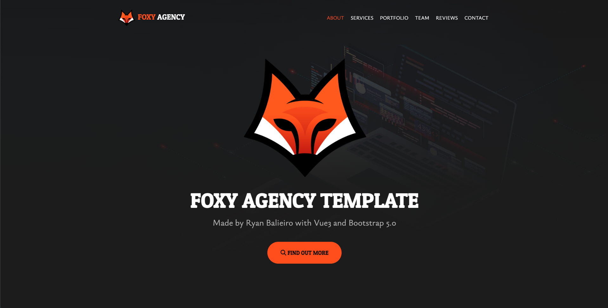

# [Agency Foxy Template](https://ryanbalieiro.github.io/foxy-template/) by Ryan Balieiro

This agency portfolio theme was created using Vue 3.0 and Bootstrap 5, all condensed into a sleek one-page layout. The theme boasts a variety of content sections, such as a portfolio gallery, testimonials, and contact information. It's designed to be fully customizable, allowing you to integrate or adapt it into your business with ease.
## Preview

**[View Live Preview](https://ryanbalieiro.github.io/foxy-template/)**

## Status

## Usage

To begin, clone the theme's source files and navigate to its root directory. Then, execute `npm install` followed by `npm run dev`. This will open a preview of the template in your default browser, keep an eye out for changes in the core template files, and automatically reload the browser upon saving any modifications. To get a comprehensive list of available scripts, refer to the "package.json" file.

Running `npm run build` will build the entire project, which includes compiling assets, HTML, JS, and CSS into "dist". 

To use this build environment, make sure you have npm installed on your system.

## About

This template was created by and is maintained by **[Ryan Balieiro](https://ryanbalieiro.com/)**.

The template is based on the [Bootstrap](https://getbootstrap.com/) framework created by Mark Otto and Jacob Thorton; and the [Vue](https://vuejs.org/) framework created by Evan You.

## Copyright and License

Code released under the [MIT](https://github.com/StartBootstrap/startbootstrap-agency/blob/master/LICENSE) license.